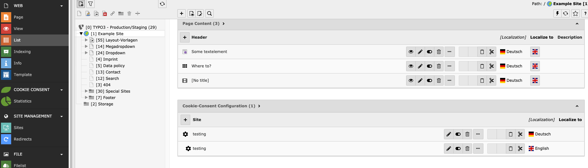
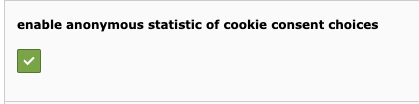

.. include:: ../Includes.txt

.. _for-developers:

==============
For Developers
==============

.. toctree::
   :maxdepth: 2

   TypoScript

Configuration
=============

The Cookie Consent Configuration plugin is set automatically on every root page.

   BE View of Cookie Consent Configuration

If you want the same configuration for every site you can choose "All Sites" in the configuration details. Otherwise you can configure the cookie consent for every root page separately.

**Important information:** Beware, that the cookie options configured in the Cookie Consent Configuration Plugin in the backend have no effect yet. Names and descriptions of the cookies will appear in the modal in the frontend, but to properly block and allow cookies, you need to use the event listener (s. section below).

As the developers of this extension, we have already implemented it for several of our customers. If you need any assistance with the configuration of the cookies on your website, feel free to contact us - we gladly provide assistance on an hourly basis.

Site configuration for statistics backend module
================================================

If you want to collect statistics about which cookies get accepted, you need to enable statistics in the configuration.

   enable statistics in the Cookie Consent Configuration

You also need to configure the route enhancer for cookie.json. Otherwise the ajax request sent by the cookie consent form will not work.

.. code-block:: yaml

    routeEnhancers:
      PageTypeSuffix:
        type: PageType
        default: ''
        index: 'index'
        map:
          'cookie.json': 8641

The Cookie Consent event listener
=================================

Changing the cookie consent options fires an event, that you can work with.

.. code-block:: javascript

    window.addEventListener('cookieConsent', function (event) {
        // check options and do something
    }

The options in the event detail are identical to the identifiers chosen in the cookie consent configuration. Pay attention to the exact spelling of the identifier.

The following example works with the google analytics cookie option:

.. code-block:: javascript

    window.analyticsLoaded = false;
    window.addEventListener('cookieConsent', function (event) {
      if (event.detail.hasOption('google_analytics')) {
       if (false === window.analyticsLoaded) {
          // load analytics
          window.analyticsLoaded = true;
       }
      } else {
        // do not load analytics
      }
    });

There is also an event when the consent buttons are replaced with the real content:

.. code-block:: javascript

    window.addEventListener('cookieConsentButtonsReplaced', function (event) {
      // do something here
    });

How to use the viewhelper to block videos
=========================================

To block youtube and vimeo videos, you just need to add the mindshapecookieconsent viewhelper to your typoscript.

.. code-block:: typoscript

    lib.contentElement.partialRootPaths.100 < plugin.tx_mindshapecookieconsent.view.partialRootPaths.0

Once activated a button will appear instead of the video iframes. After consenting to the external media cookies the iframes will appear.

Beware that this viewhelper only works with fluid styled content. If you develop your own extension and don't insert youtube videos via fluid styled content, you need to work with the event listener (see next section).

It is also important that the identifier chosen for the youtube and vimeo options are spelled "youtube" and "vimeo". Do not change the spelling in the cookie consent configuration.

How to block content using the consent viewhelper
=================================================

Similar to the viewhelper for blocking videos, you can use the consent viewhelper to block other content (e.g. Google Maps).

In the frontend you get a button instead of the content. Once the user clicks the button, they accept the cookie(s) necessary to show this content and the content will get loaded.

If you need an event, that you can listen to, you implement the viewhelper like this:

.. code-block:: html

    <m:consent identifier="google_maps" scripts="{
       googleMaps: '{
          src: \'//maps.googleapis.com/maps/api/js?key={apikey}\',
          async: 1,
          defer: 1
       }'
    }">
       

    </m:consent>
    

You choose the name for the event listener at the beginning of the inline script tag. In this case, the chosen name is "googleMaps". You can listen to this event in the javascript part and, in this case, initialize the google maps script.

If you only need a script to get loaded after the cookie(s) get accepted, you implement the viewhelper like this:

.. code-block:: html

    <m:consent identifier="google_maps" scripts="{0: '//maps.googleapis.com/maps/api/js?key={apikey}'}">
        // content to hide with a consent button
    </m:consent>
