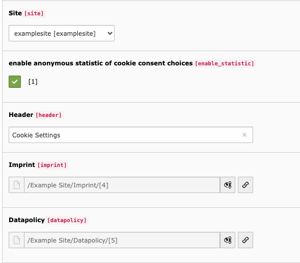
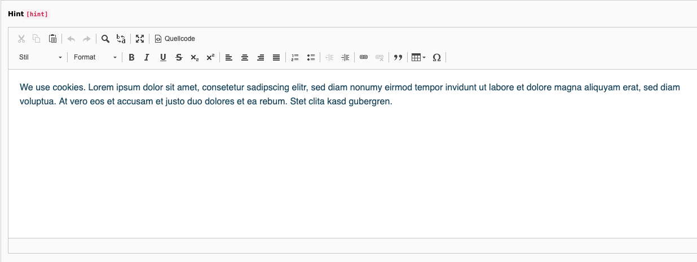
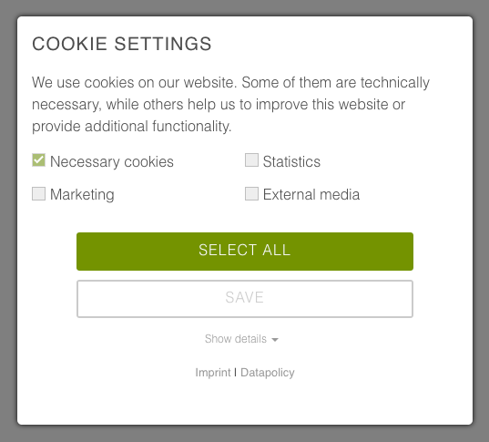
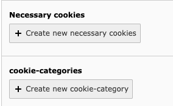
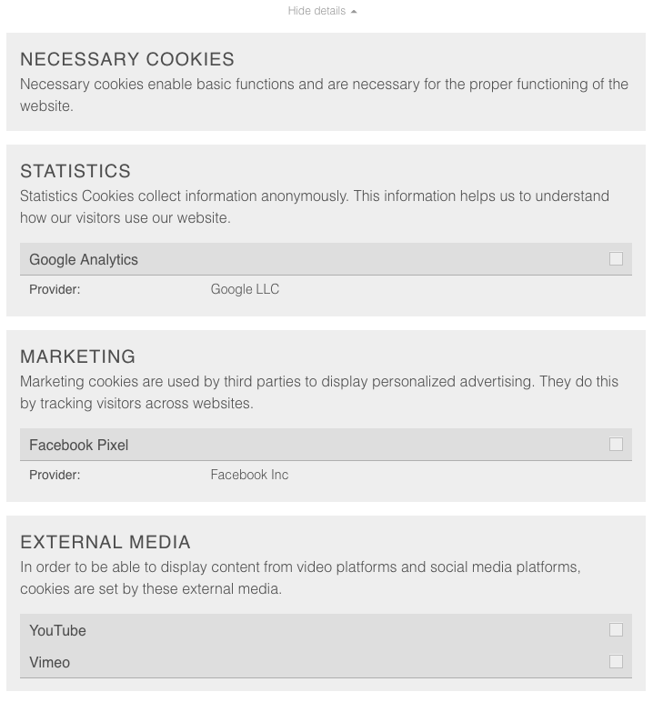
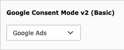
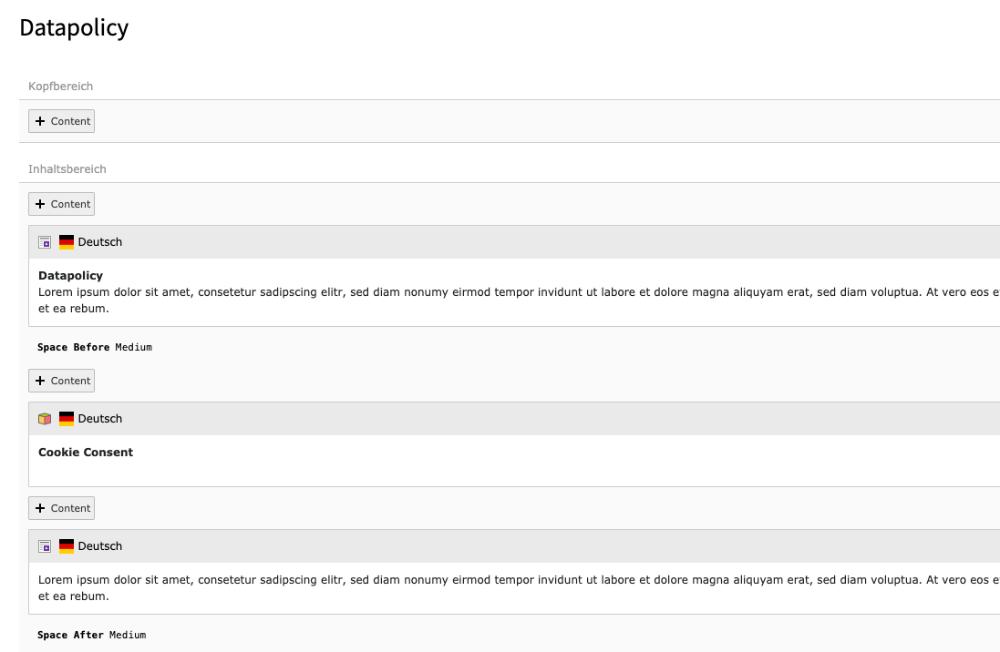
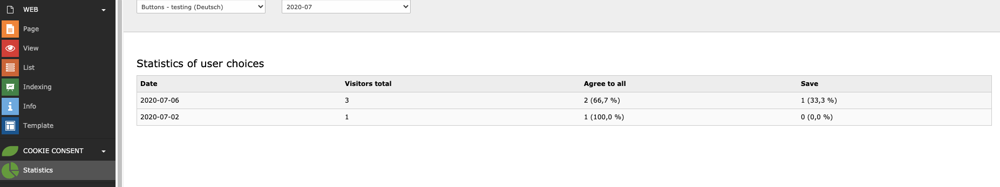

.. include:: ../Includes.txt

.. _for-editors:

===========
For Editors
===========

Configuration
=============

Open the root page in the List module to find the Cookie Consent Configuration.

.. figure:: ../Images/ConfigurationListModule.png
   :class: with-shadow
   :alt: BE View of Cookie Consent Configuration

   BE View of Cookie Consent Configuration

You can choose the site(s) the cookie consent should cover. In a multi-tree-backend it is possible to have a separate cookie consent configuration for every root.

If you enable statistics, the chosen cookie consent gets collected in the Cookie Statistics backend module.

You can link your imprint and datapolicy pages to be linked in the consent modal.

   Imprint and datapolicy to appear in Cookie Consent modal

You can edit header and hint-text, that will appear above the single cookies.

   Configuration of Cookie Hint

   Cookie Hint in FE

Creating new cookies
====================

When you create new necessary cookies, they will get listed in the cookie consent modal in the frontend. The user will not be able to uncheck the boxes for the necessary cookies, but you can provide the names, purposes and duration of those cookies.

   Create new cookies

By creating a new cookie-category, you can create the checkboxes for the single cookies and collect them in groups (e.g. the cookies of YouTube, Vimeo and Googlemaps get collected in the group "external media"). By creating a new option you get a new group. Inside this option you create new cookies.

The user can accept the whole option (e.g. all of "external media") or select a single cookie inside this option (e.g. only "YouTube").

   Cookie Options in the FE

**Important information:** Beware, that the cookie options shown in the cookie consent modal have no effect yet. To properly block and allow cookies, a developer needs to work with the event listeners (s. developer section).

Google Consent Mode
===================

| If you want to use Google Consent mode for cookies you can use the select option in the cookie options.
| For now only Google Ads & Analytics is supported, the selected options will be pushed to your TagManager with "denied" or "granted", depending on the users choice.
| See `Googles documentation <https://developers.google.com/tag-platform/security/guides/consent?hl=en&consentmode=advanced#implementation_example>`__ about this topic.
|

   Google Consent Mode select for cookies

The Cookie Consent Frontend Plugin
==================================

When you place the frontend plugin on a page, a button will appear in the frontend, that opens the cookie consent modal. The user can change the cookie consent settings and save them anew.

   Example for Cookie Consent FE Plugin

The Cookie Consent Statistics Backend Module
============================================

To see statistics here you need to have statistics enabled in the cookie consent configuration.

   example statistics in the backend module cookie consent statistics

At the moment the data collected shows the percentage of users, that clicked accept all versus those, who only accepted single cookies.

